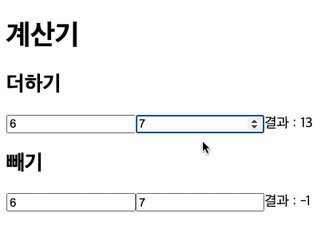

# state 끌어올리기(lifting-state-up)

input 창에 숫자를 입력하면 덧셈 연산을 해주는 컴포넌트가 있습니다.

```jsx
import React from 'react'
import { useState } from 'react';

function AddCalculator() {
  const [num1, setNum1] = useState(0)
  const [num2, setNum2] = useState(0)
  const handleNum1 = (e)=>{
    const newNum1= parseInt(e.target.value)
    setNum1(newNum1)
  }
  const handleNum2 = (e)=>{
    const newNum2= parseInt(e.target.value)
    setNum2(newNum2)
  }
  return(
    <div>
      <h2>더하기</h2>
      <input type="number" name="num1" value={num1} onChange={handleNum1}/>
      <input type="number" name="num2" value={num2} onChange={handleNum2}/>
      결과 : {num1+num2}
    </div>

  )
}

function App() {
  return (
    <div>
      <h1>계산기</h1>
      <AddCalculator/>
    </div>
  );
}

export default App;
```


우리는 아래와 같은 뺄셈 연산을 해주는 컴포넌트를 새로 만들었습니다.

```jsx

function SubCalculator() {
  const [num1, setNum1] = useState(0)
  const [num2, setNum2] = useState(0)
  const handleNum1 = (e)=>{
    const newNum1= parseInt(e.target.value)
    setNum1(newNum1)
  }
  const handleNum2 = (e)=>{
    const newNum2= parseInt(e.target.value)
    setNum2(newNum2)
  }
  return(
    <div>
      <h2>빼기</h2>
      <input type="number" name="num1" value={num1} onChange={handleNum1}/>
      <input type="number" name="num2" value={num2} onChange={handleNum2}/>
      결과 : {num1-num2}
    </div>

  )
}

```

새로 만든 뺄셈 연산을 하는 컴포넌트를 우리의 계산기에 추가했습니다!

```jsx
function App() {
  return (
    <div>
      <h1>계산기</h1>
      <AddCalculator/>
      <SubCalculator/>
    </div>
  );
}
```


빼기 컴포넌트 추가

- 전체코드
    
    ```jsx
    import React from 'react'
    import { useState } from 'react';
    
    function AddCalculator() {
      const [num1, setNum1] = useState(0)
      const [num2, setNum2] = useState(0)
      const handleNum1 = (e)=>{
        const newNum1= parseInt(e.target.value)
        setNum1(newNum1)
      }
      const handleNum2 = (e)=>{
        const newNum2= parseInt(e.target.value)
        setNum2(newNum2)
      }
      return(
        <div>
          <h2>더하기</h2>
          <input type="number" name="num1" value={num1} onChange={handleNum1}/>
          <input type="number" name="num2" value={num2} onChange={handleNum2}/>
          결과 : {num1+num2}
        </div>
    
      )
    }
    
    function SubCalculator() {
      const [num1, setNum1] = useState(0)
      const [num2, setNum2] = useState(0)
      const handleNum1 = (e)=>{
        const newNum1= parseInt(e.target.value)
        setNum1(newNum1)
      }
      const handleNum2 = (e)=>{
        const newNum2= parseInt(e.target.value)
        setNum2(newNum2)
      }
      return(
        <div>
          <h2>빼기</h2>
          <input type="number" name="num1" value={num1} onChange={handleNum1}/>
          <input type="number" name="num2" value={num2} onChange={handleNum2}/>
          결과 : {num1-num2}
        </div>
    
      )
    }
    
    function App() {
      return (
        <div>
          <h1>계산기</h1>
          <AddCalculator/>
          <SubCalculator/>
        </div>
      );
    }
    
    export default App;
    ```
    

여기서 만약 state값이 서로 공유가 되어야 한다면 어떻게 해야 할까요? 실제로 이런 경우가 많이 발생되게 되는데요. 예를 들어 쇼핑몰 장바구니 페이지를 만든다고 했을 때 수량을 수정하면 다른 컴포넌트의 가격도 수정이 되어야 하는 경우가 있습니다.

여기서는 더하기의 값을 올렸을 때 빼기 컴포넌트에 숫자도 변경이 되고 동시에 위에서는 더하기를, 아래에서는 빼기가 수행되어야 할거에요.

예를들어,
- 더하기에 10, 30을 입력하면 덧셈 결과로 40을 출력합니다.
- 동시에 빼기 결과에도 10-30을 연산한 -20을 출력합니다.


목표예시 이미지

위와 같은 형태로 만들기 위해서는 각각의 컴포넌트에서 동일한 데이터로 유지되어야하는 것을 찾아낼 수 있습니다. `num1`, `num2`로 존재하는 state겠네요. 이것을 공통 부모인 App 컴포넌트로 옮겨보도록 하겠습니다. 

아래와 같이 바꿔주세요.

```jsx
import React,{ useState } from 'react';

//AddCalculator컴포넌트와 SubCalculator컴포넌트의 공통된 값들을 전부 props로 받도록 만들어줍니다.
function AddCalculator(props) {
  return(
    <div>
      <h2>더하기</h2>
      <input type="number" name="num1" value={props.num1} onChange={props.handleNum1}/>
      <input type="number" name="num2" value={props.num2} onChange={props.handleNum2}/>
      결과 : {props.num1+props.num2}
    </div>

  )
}

function SubCalculator(props) {
  return(
    <div>
      <h2>빼기</h2>
      <input type="number" name="num1" value={props.num1} onChange={props.handleNum1}/>
      <input type="number" name="num2" value={props.num2} onChange={props.handleNum2}/>
      결과 : {props.num1-props.num2}
    </div>

  )
}

function App() {
  const [num1, setNum1] = useState(0)
  const [num2, setNum2] = useState(0)
  const handleNum1 = (e)=>{
    const newNum1= parseInt(e.target.value)
    setNum1(newNum1)
  }

  const handleNum2 = (e)=>{
    const newNum2= parseInt(e.target.value)
    setNum2(newNum2)
  }

  return (
    <div>
      <h1>계산기</h1>
      <AddCalculator num1={num1} num2={num2} handleNum1={handleNum1} handleNum2={handleNum2}/>
      <SubCalculator num1={num1} num2={num2} handleNum1={handleNum1} handleNum2={handleNum2}/>
    </div>
  );
}

export default App;
```

각각 덧셈과 뺄셈 연산을 해주는 컴포넌트에서 공통적으로 관리될 상태(num1, num2)를 가장 가까운 공통 부모 컴포넌트(App)에 끌어올려 주었습니다. 간단한 방법으로 중복 데이터에 대한 관리를 할 수 있습니다.



실행예시

이렇게 각기 다른 컴포넌트에서 같은 데이터(상태)를 다루고 싶은 상황들이 생깁니다. 이때 사용해야 하는 것이 “**State 끌어올리기”**입니다!