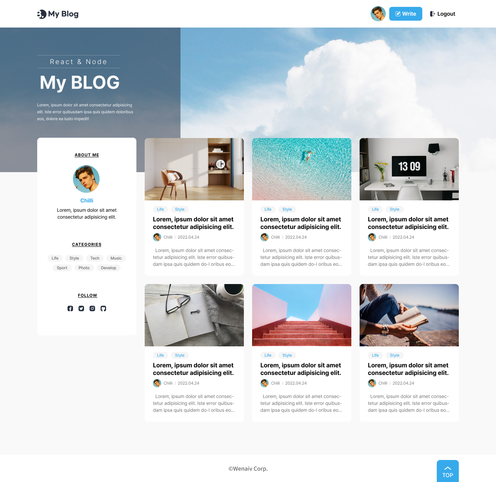
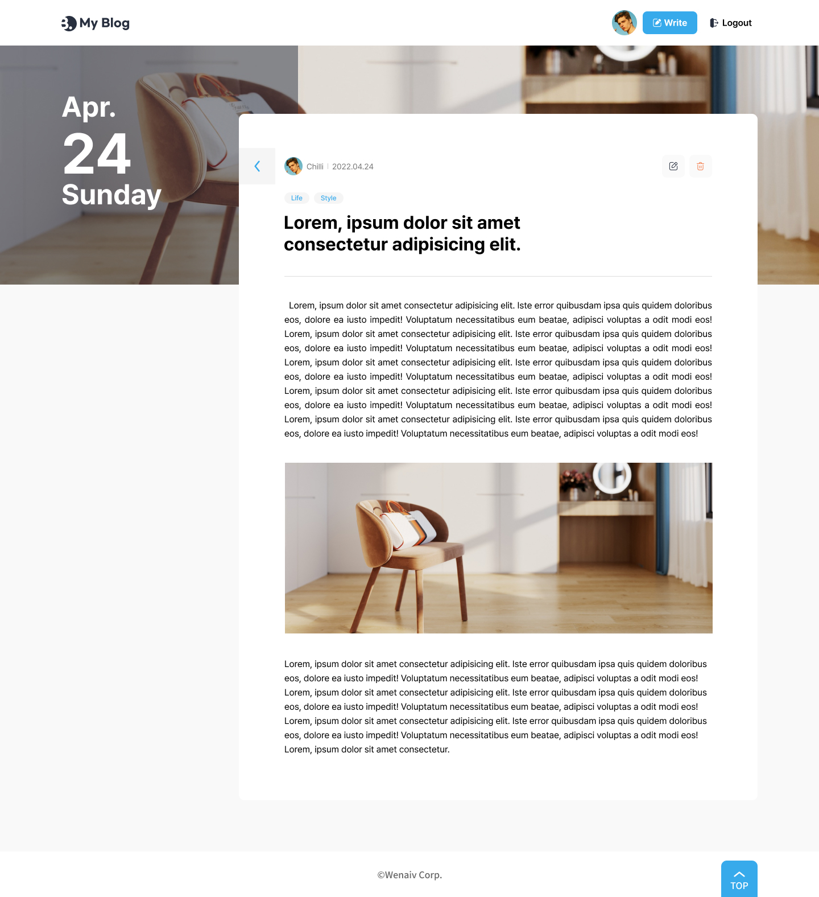

# 요구사항 및 Asset

## 1. 블로그 메인, 게시글 뷰 페이지 UI React로 변환하기

- HTML, CSS로 만들어진 페이지를 React로 변환해보세요.

**작업할 페이지 미리보기(HTML/CSS)**

## 2. 기본 Asset

### 2.1 HTML/CSS Branch

[https://github.com/weniv/react-blog](https://github.com/weniv/react-blog)

블로그 메인페이지와 게시글 뷰페이지가 HTML/CSS로 작업되어 있습니다.

### 2.2 React Branch

[https://github.com/weniv/react-blog/tree/react](https://github.com/weniv/react-blog/tree/react)

필요한 더미데이터, 이미지 파일들이 들어 있습니다. 

다운로드 후 실행하기

1. `npm i`
2. `npm start`

## 3. 🧑‍💻React 실습하기

- 해설 영상을 보기 전 반드시 혼자 해보세요. 간단한 힌트만 보고 오셔도 좋습니다. 해보셔야 늘고, 자신감이 생깁니다.
- 기존 HTML/CSS 파일을 이용하여 React 작업을 해보세요.
    1. 컴포넌트 만들기
    2. Router를 사용하여 페이지 라우팅 처리하기
    3. state 처리를 통해 header 버튼 바꾸기
        - logout
            
            
            
        - login
            
            
            
    4. 더미 데이터를 가져와 게시글, 블로그 정보, 유저정보 뿌려주기
    5. styled components 사용해보기